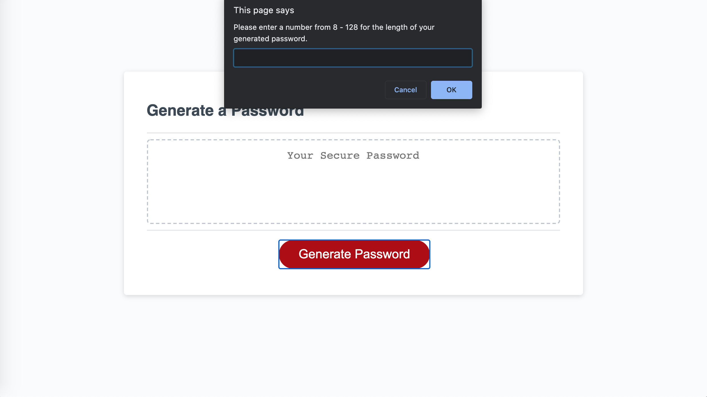

# Password Generator 
This repository contains an application that generates a random password based on the password criteria. When the button is pressed, the user will be asked a series of prompts for the length of their password as well as the character types that will be included in it. After the prompts have been answered, a random password will be generated. 

## Built With
* HTML
* CSS
* JavaScript

## Screenshots

## Website
https://stevenmly.github.io/Password-Generator/

## Contribution
Made with ❤️ by Steven Ly
